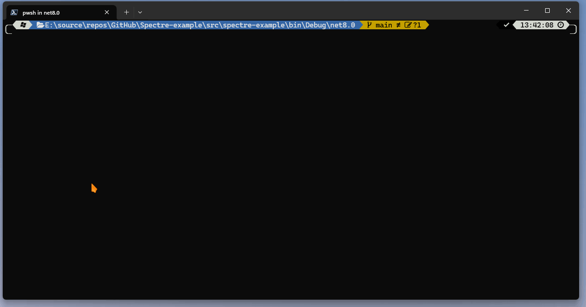

# Exmaple on how to use SpectreConsole

Examples using [SpectreConsole](https://spectreconsole.net/) for C# and .NET.

## Progress bar

Display a progress bar while executing multiple tasks in parallel.
When a task is completed the progress bar will be removed.
The number of parallel tasks is limited (configurable). In case an exception is thrown
it will be collected and displayed at the end.

